# Write-up

### Analyze, choose, and justify the appropriate resource option for deploying the app.

#### Analyze costs, scalability, availability, and workflow

##### Costs
###### Criteria

Actual computing resouce usage can be observed as below when I deployed the app in the *App Service* environment.
Based on this, I compare the computing machine cost betweeen *App Service* and *Virtual Machine* using the Micsoft Azure price estimateor tool (https://azure.microsoft.com/en-us/pricing/calculator/).

CPU and Memory usage

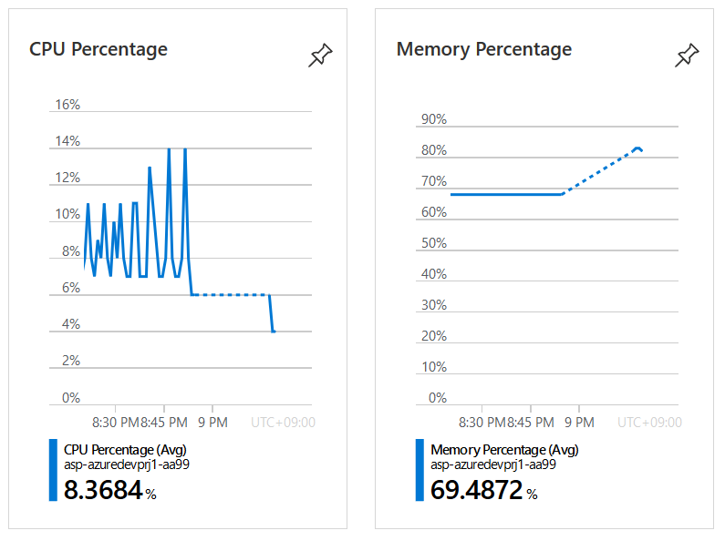

File System Usage

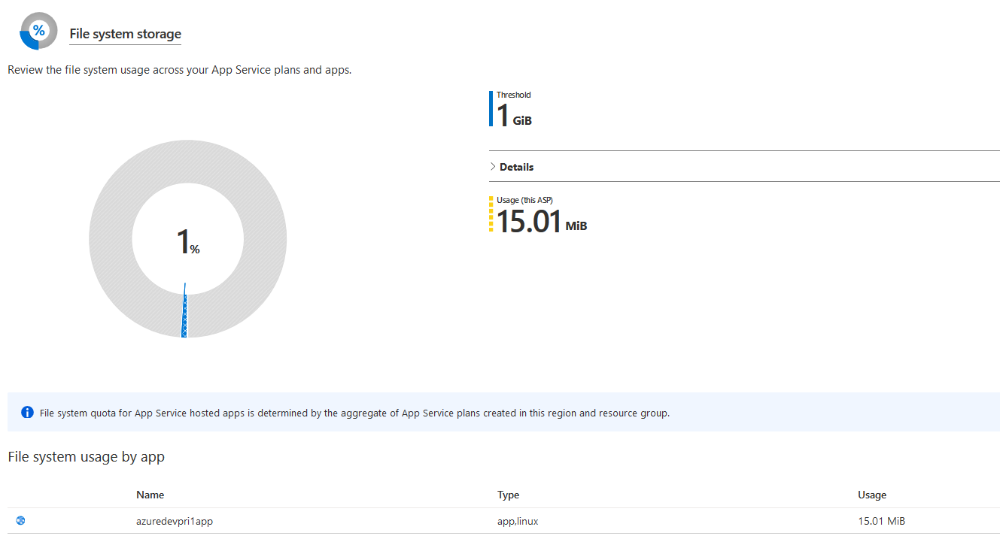

- Mimum disc size
- Memory size selection is around 2GB
- 1 vCPU (CPU usages is 14% max in my app)
- Japan East
- Linux (for VM selected Cent OS)

###### Computing cost comparison

Monthly cost calculated by Micsoft Azure price estimateor tool (https://azure.microsoft.com/en-us/pricing/calculator/)
indicates *App Service* is more cost effective compared to *Virtual Machine*.

- *App Service* price estimate $13.87/month

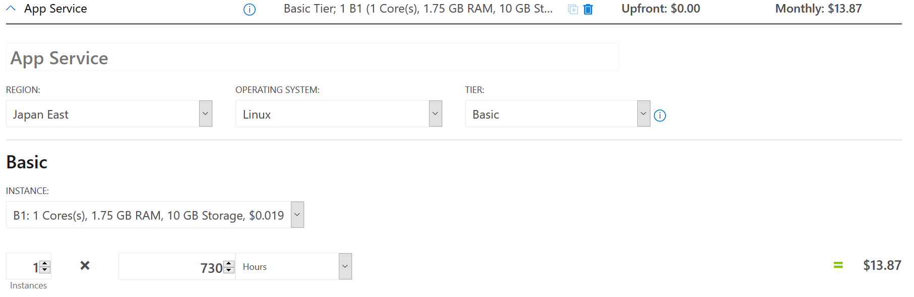

- *Virtual Machin* price estimate $19:91/month

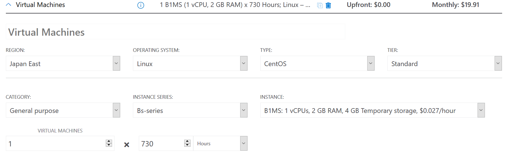

##### Scalability

(cf. https://docs.microsoft.com/en-us/azure/architecture/guide/technology-choices/compute-decision-tree#scalability)

*App Service* can utilize auto-scaling based on usage. Easier to maintain.
*Virtual Machine* uses scale sets and more larger scaling is possible.

##### Availability

(cf. https://docs.microsoft.com/en-us/azure/architecture/guide/technology-choices/compute-decision-tree#availability)

In the case high availability is critical *Virtual Machine* is the choice.
But most of the cases *App Service* provide enough level of SLA and easier operation.

*Vitual Machine* gurantees 99.99% as below:
* from https://azure.microsoft.com/en-us/support/legal/sla/virtual-machines/v1_9/
For all Virtual Machines that have two or more instances deployed across two or more Availability Zones in the same Azure region, we guarantee you will have Virtual Machine Connectivity to at least one instance at least 99.99% of the time.*

As stated above, *Virtual Machine* requies consideration of *two or more instances* to achiev high availabilit. This impacts the cost calculation above ($19.91 per month for a single instance), and also requires other computing resouces for high availability mechanism, such as load balancing.

*App Service* is easier option as it has built-in high availability feature, while the SLA indicated is less than that is achivable with *Virtual Machine* (cf. https://azure.microsoft.com/en-us/support/legal/sla/app-service/v1_4/).

##### Workflow

*App Service* can maintain the code up to date to the latest GitHub for itsu continuous deployment feature.
This makes my easy to try and error while developing this application.

*Virtual machine* requies tools for DevOps to achive that feature, while it provides more control not only the source code,
but also OS anf network for optimizations.

Like the case we did this time, for prototyping a simple application with a lightweight framework (Flask for example), *App Service* is the better choice.
#### Choose the appropriate solution (VM or App Service) for deploying the app

I choose to deploy this application using an *Azure App* Service

#### Justify your choice 

*App Service* can be justified in this scenario.
The feature required in this scenario is simple.
Just to evaluate the connectivity to DB and simply register and browse data into those DB with a light framework.

Environment settings for DB connectivity, deployment, log management can be accomplished within the *App Service*.

If the application requirements becomes more complest to separate the function and logics, VMs could be the better choice.

### Assess app changes that would change your decision.

As above simple single Web app fits to *App Service*.
But in the cases of enterprise applications which requires high availability with higher SLA and complex architecture, whose functions are deployed in multiple components, *Virtual Machine* comes to a choice.
*Virtual Machince* provides full control on OS, network, and other computing resources.

(cf. https://docs.microsoft.com/en-us/azure/architecture/guide/technology-choices/compute-decision-tree)
## Project Rublic

### Resource Group

#### All relevant resources are contained in a single resource group.

The resource group must include a Storage Account, SQL Server, SQL Database, as well as any relevant services for deploying the web app.

Provide a screenshot of the resource group in Azure, containing your running resources.

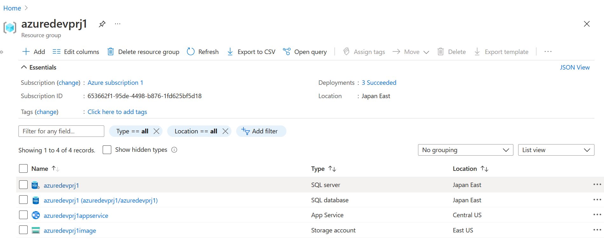

### Storage

#### Create and add article data to a SQL Server in Azure.
	

A SQL Server is created in Azure and is capable of storing the necessary article data (title, author, body).

Provide a screenshot from your SQL database within Azure, showing that both the posts and users tables have been created. Alternatively, if the site is still live, provide the URL for the site.

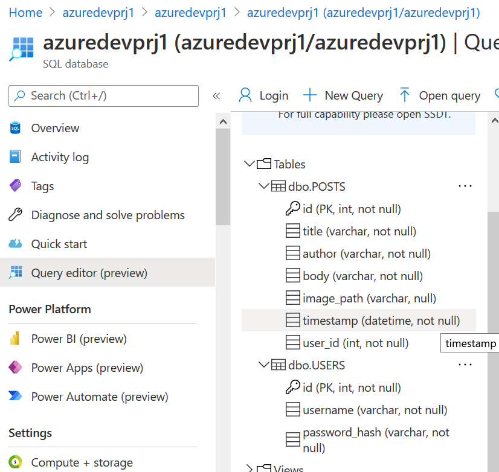

#### Create and upload images to a Storage Account.
	

A Storage Account is created in Azure and is capable of storing the necessary image data for an article.

Provide a screenshot from your Storage Account within Azure, with the blob storage endpoint URL visible (can be seen in “Settings”->”Properties”). Alternatively, if the site is still live, provide the URL for the CMS site to show images are able to be stored and viewed.

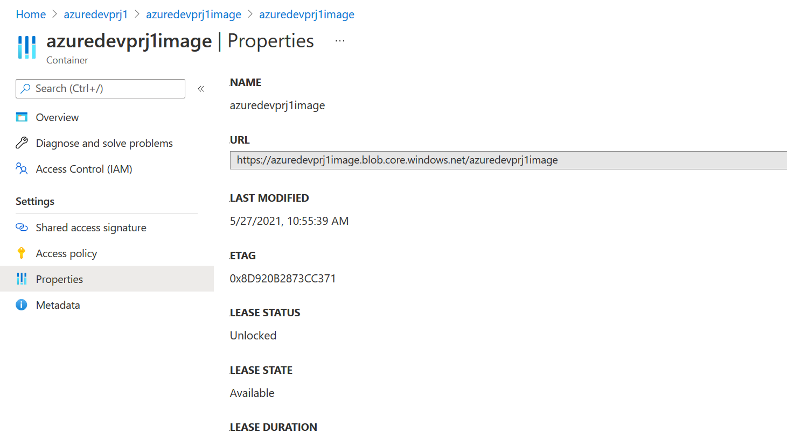

The uploaded file

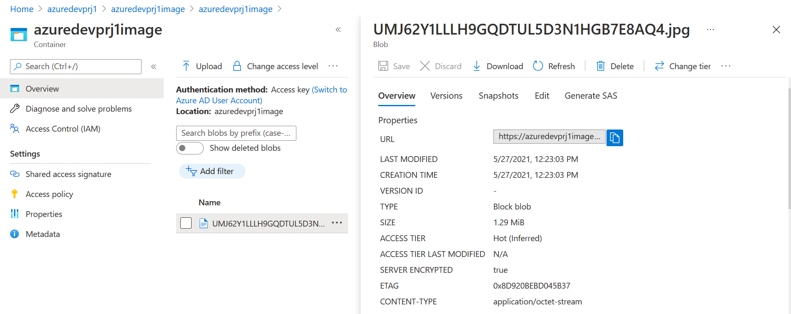

### Deployment

#### The Python web app is deployed to Azure.

The Python web app has been deployed to Azure using the chosen resource in the previous section.

As evidence, provide a screenshot of the Python application running from a browser (this can be part of the screenshot in the next section). The screenshot should include the URL and the black header that states “Article CMS”. Alternatively, you can provide a link to the deployed app, if it is still live.

https://azuredevprj1appservice.azurewebsites.net

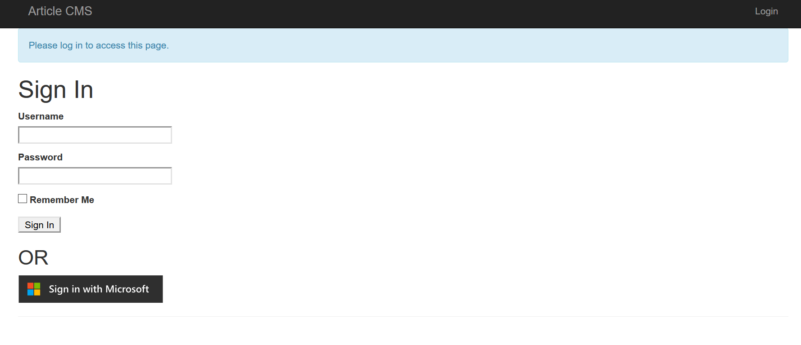

#### The Python web app is able to connect to storage.

The Python web app is able to connect to the related storage solutions.

As evidence, provide a screenshot of the Python application running from a browser. The screenshot should include the URL and at least one article containing title, author, body, and an image. Alternatively, you can provide a link to the deployed app, if it is still live.

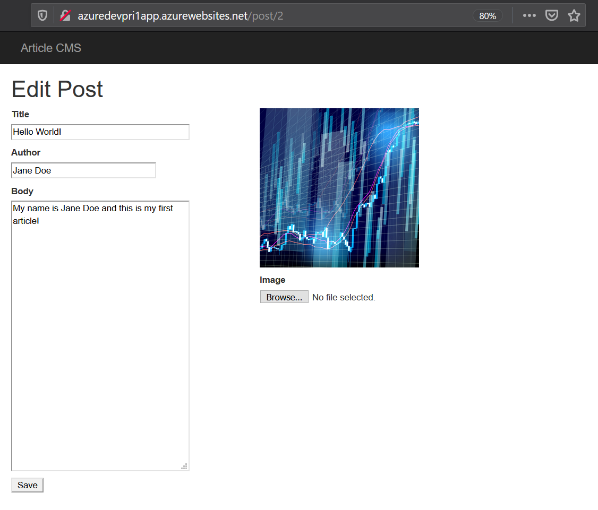

### Security & Monitoring

#### Add a functioning “Sign in with Microsoft” option to the app.

The Python web app has an additional, operational option to sign in with Microsoft.

As evidence, provide a screenshot of the redirect URIs configured within the App Registration page in Azure. Alternatively, you can provide a link to the deployed app, if it is still live.

Additionally, your code in views.py should appropriately implement the Microsoft sign-in button using the msal library.

The image is stored as indicated in the *The Python web app is able to connect to storage*.

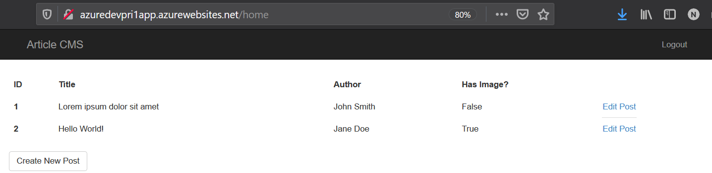

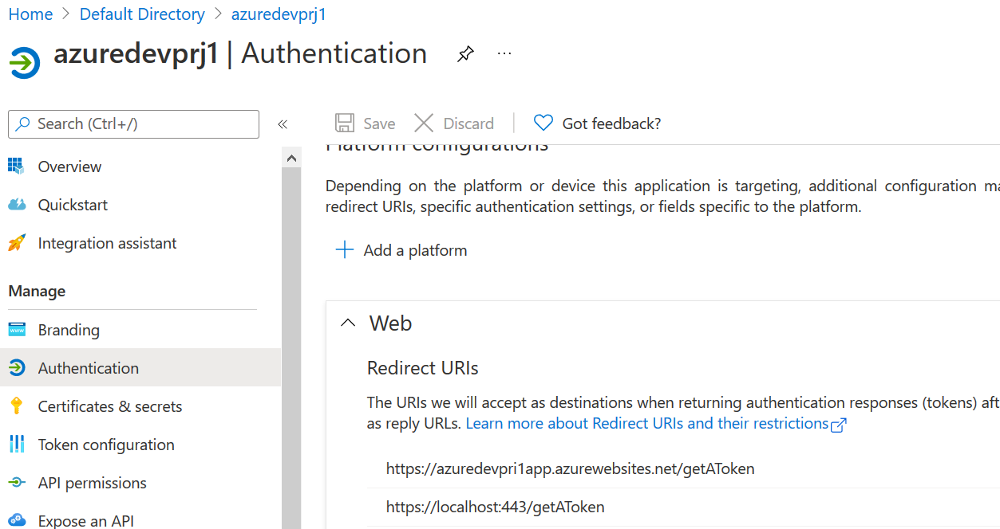

#### Access attempts to the app are logged.

Both successful and unsuccessful attempts to access the web app are logged.

As evidence, provide a screenshot or download the logs from Azure containing at least one successful and one unsuccessful access attempt, and include in your submission files. If otherwise submitting a URL, please include a link to screenshot/logs in the “Submission Details” box on the project submission page.

Successful access "2021-05-28T22:05:25.812473854Z login" can be seen in the following screen shot.
This is I put in the source code(https://github.com/HajimeK/nd081-c1-provisioning-microsoft-azure-vms-project-starter/blob/master/FlaskWebProject/views.py).

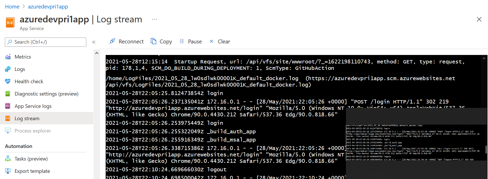

For an unsuccessful case, please find below.
